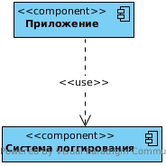
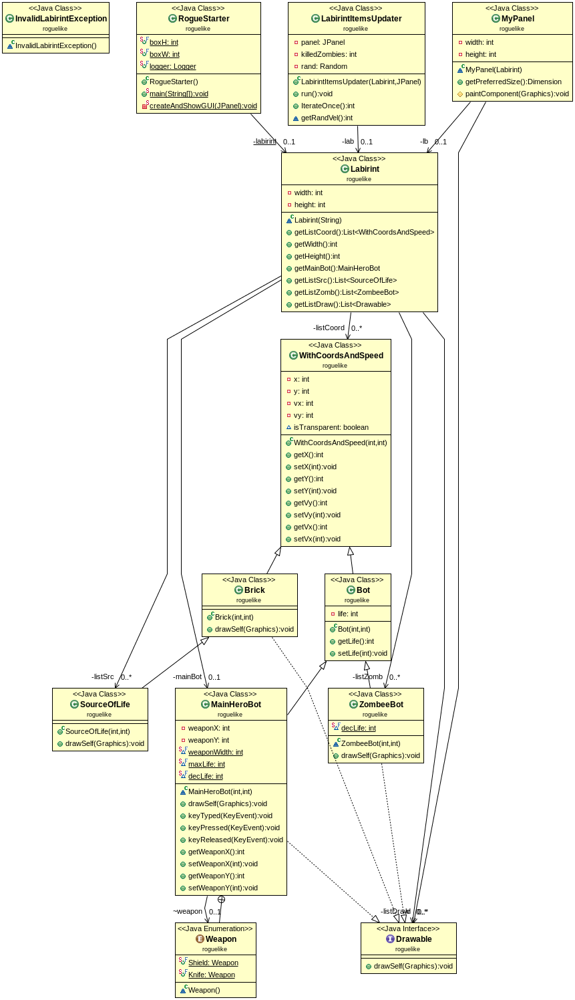
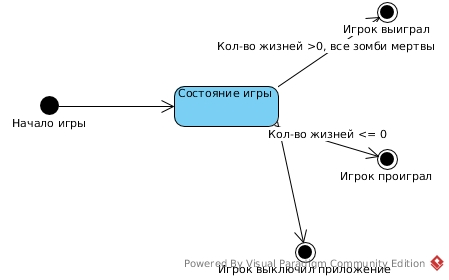
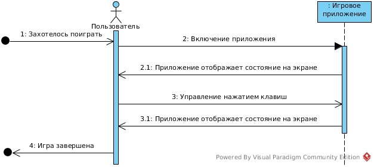

## Диздок
### Общие сведение о системе

#### Назначение

Игра компьютерная, предназначена для организации времяпрепровождения пользователя.
Является десктопным приложением.
Игра является 2D ходилкой по лабиринту. Пользователь управляет ботом. Целью игры является уничтожение с помощью этого бота других ботов зомби.

У каждого бота (главного, управляемого, и ботов зомби) есть запас жизни. Запас жизни тратится во время боя.

Бой происходит в тот момент, когда главный бот и зомби находятся в соседних по стороне клетках. В бою у ботов уменьшается запас жизни. Скорость уменьшения зависит от конфигурации вооружения главного бота.

В каждый момент времени главный бот вооружен либо мечом, либо щитом. Их можно направить в одну из четырёх сторон от бота. Щит защищает от уменьшения жизни при контакте с зомби, если он направлен в сторону зомби.

Если бот вооружен мечом, то при контакте с зомби, если меч направлен в сторону контакта, у последнего уменьшается количество жизней. При этом у главного боте тоже уменьшаеся.

### Architectural drivers

Во первых, приложение было решено писать на языке Java, так как в нём имеется подходящая встроенная графическая библиотека Swing, а так же удобные системы сборки для использования сторонних библиотек.

Сведения о изначальном состоянии лабиринта хранятся в текстовом файле. Этот способ выбран как наиболее простой. Его недостатки &ndash; у пользователя не очень большой выбор различных лабиринтов.

Все рисуемые объекты реализуют интерфейс `Drawable` и ссылки на них хранятся в списке для отрисовки.

В каждый момент времени бот занимает клетку лабиринта, то-есть минимальное смещение &ndash; это одна клетка. Перемещаться бот может только в соседнюю по стороне клетку. Такое решение принято для упрощения обработки взаимодействия между объектами лабиринта без сильно потери качества графики.

Объекты в лабиринте могут быть либо твёрдыми, либо проницаемыми. Два твёрдых объекта не могут занять одну клетку, и если находятся в соседних по стороне клетках, не могут сдвинуться в направлении друг друга. Проницаемые объекты могут занимать одну клетку.

Взамодействие между объектами обрабатывается в ходе периодического попарного перебора объектов, проверки их касания и произведения дальнейших действий в зависимости от их типов и состояний.

В частности, перед каждым обновлением положения бота проверяется, что на том направлении, куда он хочет переместиться, нет твёрдого объекта.

Управление главным ботом происходит с помощью клавиатуры. Для получения сигналов нажатия клавиш бот добавляется в качестве `KeyListener` к панели графического интерфейса.

### Описание типичного пользователя

Скорее всего это человек, желающий отвлечься от работы. Он хочет немного поиграть, при этом не втягиваясь основательно в процесс. Ожидаемое время игры 10 минут. Дальше надоест.

### Диаграмма компонентов

Здесь изображены компоненты приложения. Оно не очень большое, поэтому можно выделить только две основные компоненты. Во-первых, это само приложение. Ещё один компонент, который можно выделить &ndash; используемая готовая система логгирования.

### Диаграмма классов

Здесь изображены следующие классы:

`RogueStarter` &ndash; инициирует запуск приложения, содержит метод `main` программы.

`Labirint` &ndash; содержит всю информацию о текущем состоянии лабиринта, хранит ссылки на все объекты в соответствующих списках. Конструирует лабиринт по описанию из файла, переданного в конструктор. 

`MyPanel` &ndash; наследник `JPanel`, на нем происходит отрисовка всех объектов.

`WithCoordsAndSpeed` &ndash; базовый класс для объектов, присутствующих в игре. Хранит координаты текущей клетки и скорость.

`Brick` &ndash; кирпичи, из которых состоят стены лабиринта.

`Bot` &ndash; базовый класс для ботов в игре.

`MainHeroBot` &ndash; бот, которым управляет игрок.

`ZombeeBot` &ndash; зомби-бот, с которыми надо бороться.

`SourceOfLife` &ndash; неподвижный элемент лабиринта, в котором можно пополнить запас жизней.

`LabirintItemsUpdater` &ndash; класс, обеспечивающий взаимодействие между всеми объектами лабиринта.

`Weapon` &ndash; предствляет тип вооружения, которое в данный момент находится у главного бота.

`Drawable` &ndash; этот интерфейс выполняется всеми игровыми объектами, которые нужно отрисовывать.

### Взаимодействия и состояния

После начала игры пользователь может завершить её либо уничтожив всех зомби-ботов, тогда он выигрывает, либо проигрывает, если в какой-то момент у главного бота закончились жизни.

Также игрок может просто закрыть приложение.

На диаграмме последовательностей показано, как игрок начинает играть, включив приложение. Дальше он управляет приложением с помощью клавиатуры, приложение отвечает отображаю информацию на экране.

